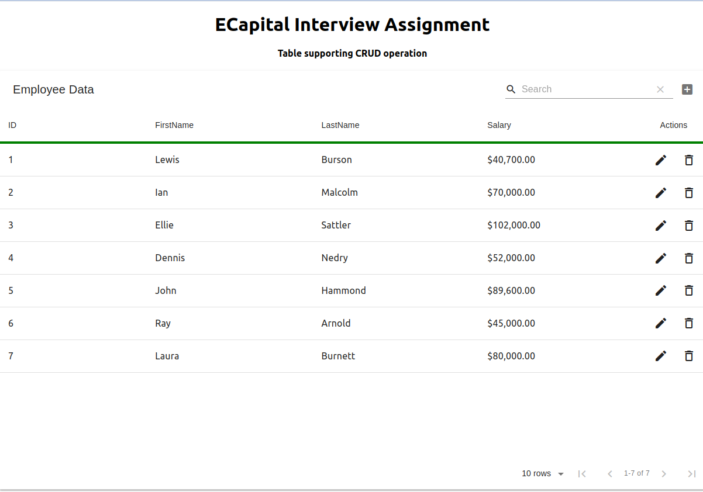

# ECapital-Interview-Assignment #
````{verbatim}
.
├── client
│   ├── docker
│   │   └── Dockerfile
│   ├── node_modules
│   ├── package.json
│   ├── pnpm-lock.yaml
│   └── src
│       ├── App.js
│       ├── asset
│       │   ├── App.css
│       │   └── index.css
│       ├── components
│       │   └── EmployeeTable.jsx
│       └── index.js
├── db
│   ├── Dockerfile
│   └── dump.sql
├── docker
│   └── docker-compose.yaml
├── LICENSE
├── README.md
└── server
    ├── data
    │   └── mysqlConnection.js
    ├── docker
    │   └── Dockerfile
    ├── index.js
    ├── node_modules
    ├── package.json
    ├── pnpm-lock.yaml
    └── routes
        └── EmployeeInfo.js
````

 This is a simple web-app using Node.Js Express backend, React frontend, and Mysql. It supports CRUD operations on an Employee table in the UI.

 Currently, the web application is containerized into front-end, back-end, and DB. A `docker-compose.yaml` file is ready for spinning up a working demo. 

 However, the original intent was to take one more step forward and use `kubernetes` to illustrate a setup that is scalable based on real-time supervised resource consumption level. This is not achieved yet in the current demo due to limited time.

----




# Instructions To Run #

 With Docker installed one can easily spin up a demo with the following command at the project root directory

```
docker-compose -f docker/docker-compose.yaml up --build
```

Upon success, visit [http://localhost:8080](http://localhost:8080).

To spin down gracefully

```
docker-compose -f docker/docker-compose.yaml down
```

In the case that local image build is hindered, one can pull pre-built images by editing `docker/docker-compose.yaml`: 
```
...
api:
    build:
      context: ./server
      dockerfile: ./docker/Dockerfile
    # image: leoluheng/nodejs-api:demo
    container_name: express-back
...
```
Uncomment the `image` line and comment the `build` block for all three entities : `api`, `mysqldb`, `frontend`.


# Original instructions #
# Take-home Assignment (Full Stack) #

### Goal: ###
* Create an Employee Table like the one in the image below.
* Use any front-end framework (Angular, React, Vue, ect...) or CSS library to accomplish this.
* Implement the back-end API with a Node.js framework, and a SQL database
### Functional Requirements: ###
* Initially, list all employees that are in data.json
  * First name, last name, and salary in currency format (ie. $42,000)
* The ability to edit an employee
* The ability to delete an employee
* The ability to create a new employee

### Technical Guidelines: ###
* Structure your application and components in a modular/reusable way
* Commit code with useful and informative comments
* Your application doesn't have to use the data.json file directly, but have a SQL script to initialize your database with data found in that file
* Implement API code to read and write to a SQL database
* Styling: CSS or SCSS or SASS can be used, whichever you prefer (can use popular UI frameworks like Bootstrap as well)

### Questions? ###
Please reach out to me with any questions
